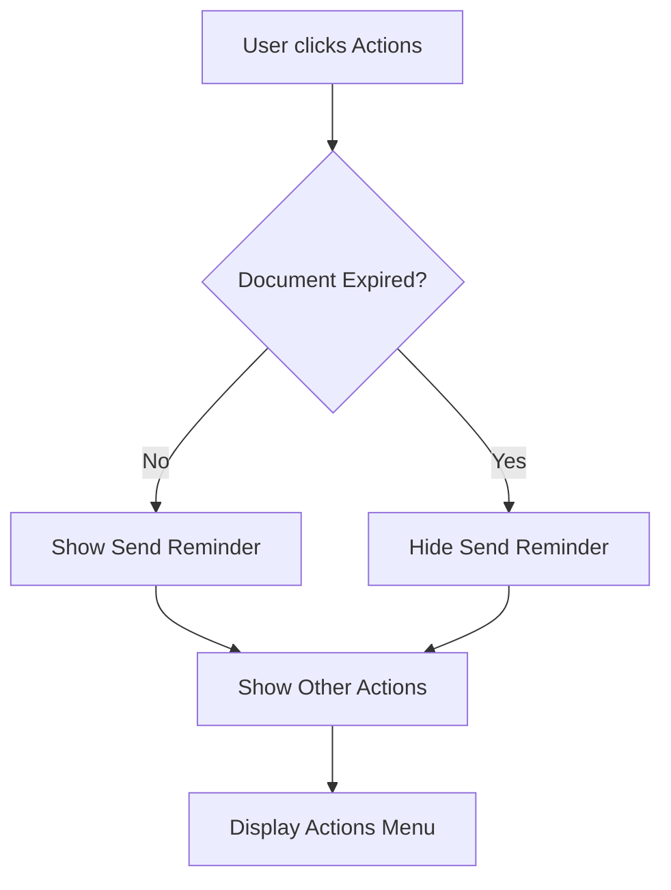

# 📋 Send Reminder Visibility Logic

## Quick Reference

### Document Actions Menu - Visibility Rules

```
┌─────────────────────────────────────────────────────────────┐
│                    Document Status                          │
├─────────────────────────────────────────────────────────────┤
│                                                             │
│  ✅ Active (Not Expired)                                    │
│     └─ Show "Send Reminder" ✓                              │
│                                                             │
│  ❌ Expired                                                 │
│     └─ Hide "Send Reminder" ✗                              │
│                                                             │
│  ✅ Completed                                               │
│     └─ No actions menu shown (already handled)             │
│                                                             │
└─────────────────────────────────────────────────────────────┘
```

## Implementation Details

### Component 1: Unified Signing Requests List

**File:** `src/components/features/documents/unified-signing-requests-list.tsx`

**Check Method:**
```typescript
!getTimeRemaining(showActionsSheet.expires_at, showActionsSheet).includes('Expired')
```

**Renders:**
```
┌──────────────────────────────────────┐
│      Document Actions                │
├──────────────────────────────────────┤
│                                      │
│  📤 Send Reminder                    │  ← Only if NOT expired
│     Notify signers about pending... │
│                                      │
│  🛡️  Verify Document                 │  ← Always shown
│     Verify document authenticity     │
│                                      │
│  🗑️  Delete Request                  │  ← Always shown
│     Permanently remove this...       │
│                                      │
└──────────────────────────────────────┘
```

### Component 2: Document List

**File:** `src/components/features/documents/document-list.tsx`

**Check Method:**
```typescript
!isRequestExpired(request)

// Where isRequestExpired is:
const isRequestExpired = (request: SigningRequestListItem): boolean => {
    if (!request.expires_at) return false
    return new Date(request.expires_at) < new Date()
}
```

**Renders:**
```
┌──────────────────────────────────────┐
│  ⋮  Actions Menu                     │
├──────────────────────────────────────┤
│                                      │
│  👁️  View Details                    │  ← Always shown
│                                      │
│  📤 Send Reminder                    │  ← Only if NOT expired
│                                      │
│  🗑️  Cancel Request                  │  ← Always shown
│                                      │
└──────────────────────────────────────┘
```

## Decision Flow



## Code Comparison

### Before (❌ Issue)

```typescript
// Always showed Send Reminder, even for expired documents
<button onClick={() => handleShare(showActionsSheet)}>
    <Share2 className="w-5 h-5 text-blue-600 mr-3" />
    <div>
        <p className="font-medium text-gray-900">Send Reminder</p>
        <p className="text-sm text-gray-600">Notify signers about pending signatures</p>
    </div>
</button>
```

### After (✅ Fixed)

```typescript
// Only shows Send Reminder if not expired
{!getTimeRemaining(showActionsSheet.expires_at, showActionsSheet).includes('Expired') && (
    <button onClick={() => handleShare(showActionsSheet)}>
        <Share2 className="w-5 h-5 text-blue-600 mr-3" />
        <div>
            <p className="font-medium text-gray-900">Send Reminder</p>
            <p className="text-sm text-gray-600">Notify signers about pending signatures</p>
        </div>
    </button>
)}
```

## Test Scenarios

### Scenario 1: Active Document (Not Expired)
```
Document: "Contract.pdf"
Expires: 2025-10-15 (5 days from now)
Status: Pending

Expected Actions Menu:
✅ Send Reminder
✅ Verify Document
✅ Delete Request
```

### Scenario 2: Expired Document
```
Document: "Agreement.pdf"
Expires: 2025-09-25 (6 days ago)
Status: Expired

Expected Actions Menu:
❌ Send Reminder (HIDDEN)
✅ Verify Document
✅ Delete Request
```

### Scenario 3: No Expiration Date
```
Document: "Form.pdf"
Expires: null
Status: Pending

Expected Actions Menu:
✅ Send Reminder (shown because not expired)
✅ Verify Document
✅ Delete Request
```

### Scenario 4: Completed Document
```
Document: "Invoice.pdf"
Expires: 2025-10-15
Status: Completed

Expected:
❌ No actions menu shown at all
✅ Shows "✓ Completed" badge instead
```

## Integration Points

### 1. Time Remaining Function
```typescript
// Used in unified-signing-requests-list.tsx
const getTimeRemaining = (expiresAt: string | null, request?: any) => {
    if (!expiresAt) return 'No expiry'
    
    const now = new Date()
    const expiry = new Date(expiresAt)
    
    if (expiry < now) {
        return 'Expired'  // ← This is what we check for
    }
    
    // ... calculate remaining time
}
```

### 2. Expiration Check Function
```typescript
// Used in document-list.tsx
const isRequestExpired = (request: SigningRequestListItem): boolean => {
    if (!request.expires_at) return false
    return new Date(request.expires_at) < new Date()
}
```

## API Behavior

Even if the UI allowed sending reminders for expired documents, the API would reject it:

**API Endpoint:** `/api/signature-requests/[id]/remind/route.ts`

```typescript
// Server-side validation (already exists)
if (combinedRequest.status === 'expired') {
    return new Response(
        JSON.stringify({ error: 'Cannot send reminder for expired request' }),
        { status: 400 }
    )
}
```

**Defense in Depth:**
- ✅ UI prevents action (this fix)
- ✅ API validates and rejects (existing)
- ✅ Database constraints enforce status (existing)

## Summary

| Component | Check Method | Location |
|-----------|-------------|----------|
| Unified Signing Requests List | `getTimeRemaining().includes('Expired')` | Line 1570 |
| Document List | `isRequestExpired(request)` | Line 305 |

Both components now properly hide the "Send Reminder" option for expired documents, providing a cleaner and more intuitive user experience.

