I have created the following plan after thorough exploration and analysis of the codebase. Follow the below plan verbatim. Trust the files and references. Do not re-verify what's written in the plan. Explore only when absolutely necessary. First implement all the proposed file changes and then I'll review all the changes together at the end.

### Observations

## Current State Analysis

**Existing Infrastructure:**
- Next.js 15 with App Router and TypeScript
- Tailwind CSS with basic color palette (blue-600 primary)
- Radix UI primitives already installed (@radix-ui/react-*)
- lucide-react for icons
- clsx + tailwind-merge for className composition
- next-themes for theme support
- recharts for analytics visualization
- Inter font from next/font
- Existing landing page at `src/app/page.tsx` with basic sections

**Current Design System:**
- Clean, gradient-based design (blue-50 to indigo-50)
- Component architecture: sections in `src/components/sections/`, UI primitives in `src/components/ui/`
- Utility function `cn()` in `src/lib/utils.ts` for className merging
- Button variants: default, destructive, outline, secondary, ghost, link
- Card components with Header, Title, Description, Content, Footer
- Existing animations: CSS-based (animate-spin, animate-pulse) via Tailwind

**Missing for 2026-Ready Design:**
- framer-motion (for advanced animations)
- lenis (smooth scrolling)
- react-intersection-observer (scroll-triggered animations)
- lottie-react (JSON animations)
- Tailwind plugins for glassmorphism effects
- 3D libraries (optional: @react-three/fiber, three)

**Content Requirements:**
The user provided complete content for 10 sections: Hero, How It Works, Features Grid, Product Demo, Comparison, Integrations, Testimonials, Pricing, Security & Compliance, Final CTA, plus enhanced Footer.

### Approach

## High-Level Approach

**Phase 1: Dependency & Configuration Setup**
1. Add modern animation and interaction libraries to package.json
2. Extend Tailwind config with glassmorphism utilities, gradient masks, and 2026-ready design tokens
3. Create global CSS utilities for glass effects and advanced gradients

**Phase 2: Design System Enhancement**
4. Create reusable animation wrapper components and hooks
5. Build glassmorphic card variants and gradient background components
6. Develop scroll-triggered animation utilities

**Phase 3: Section Components**
7. Build 10 new landing page section components with modern design patterns
8. Implement interactive elements (comparison table, integration logos, testimonial carousel)
9. Add motion effects and scroll animations to each section

**Phase 4: Integration & Polish**
10. Update main landing page to use new sections
11. Enhance header/footer with new navigation links
12. Add smooth scrolling and page transitions
13. Optimize performance and bundle size

This approach prioritizes building a solid foundation (dependencies + design system) before implementing individual sections, ensuring consistency and reusability across all components.

### Reasoning

I explored the codebase structure by listing directories and reading key files including the current landing page (`src/app/page.tsx`), existing section components (`hero-section.tsx`, `features-section.tsx`, `pricing-section.tsx`), UI component library (`button.tsx`, `card.tsx`, etc.), layout components (`public-header.tsx`, `public-footer.tsx`), Tailwind configuration, and package.json. I identified the existing design patterns, component architecture, styling approach, and determined which modern libraries need to be added for the 2026-ready design stack.

## Mermaid Diagram

```mermaid
sequenceDiagram
    participant Dev as Developer
    participant Deps as Dependencies
    participant Config as Configuration
    participant DS as Design System
    participant Sections as Section Components
    participant Page as Landing Page

    Dev->>Deps: 1. Install framer-motion, lenis, lottie-react, etc.
    Dev->>Config: 2. Extend Tailwind config (glassmorphism, gradients)
    Dev->>Config: 3. Add global CSS utilities (glass effects)

    Dev->>DS: 4. Create useScrollAnimation hook
    Dev->>DS: 5. Build GlassCard component
    Dev->>DS: 6. Build AnimatedSection wrapper
    Dev->>DS: 7. Create animation-variants.ts

    DS->>Sections: 8. Build Hero Section (uses GlassCard, animations)
    DS->>Sections: 9. Build How It Works Section
    DS->>Sections: 10. Build Features Grid Section
    DS->>Sections: 11. Build Product Demo Section
    DS->>Sections: 12. Build Comparison Section
    DS->>Sections: 13. Build Integrations Section
    DS->>Sections: 14. Build Testimonials Section
    DS->>Sections: 15. Build Pricing Section
    DS->>Sections: 16. Build Security Section
    DS->>Sections: 17. Build Final CTA Section

    Sections->>Page: 18. Import all sections into page.tsx
    Page->>Config: 19. Update layout.tsx metadata
    Page->>DS: 20. Update PublicHeader with scroll effects
    Page->>DS: 21. Enhance PublicFooter styling

    Page->>Dev: ✅ Complete Send & Sign Landing Page
```



## Proposed File Changes

### package.json(MODIFY)

Add new dependencies for 2026-ready design stack:

**Animation & Motion:**
- `framer-motion` (^11.0.0) - Industry-standard animation library for React, enabling fluid page transitions, scroll-triggered animations, and gesture-based interactions
- `lenis` (^1.0.0) - Smooth scrolling engine for buttery-smooth UX, replacing default browser scroll behavior
- `react-intersection-observer` (^9.0.0) - Efficient scroll-triggered animation hooks with minimal performance overhead

**Visual Effects:**
- `lottie-react` (^2.4.0) - Lightweight JSON-based animations for hero section document flow visualization
- `react-tsparticles` (^2.12.0) + `tsparticles` (^2.12.0) - Particle effects for neural-net style backgrounds (optional, for advanced visual polish)

**3D & Advanced Graphics (Optional):**
- `three` (^0.160.0) - 3D library for floating document visualizations
- `@react-three/fiber` (^8.15.0) - React renderer for Three.js
- `@react-three/drei` (^9.95.0) - Useful helpers for lighting, cameras, and 3D scene setup

**Tailwind Enhancements:**
- `tailwindcss-filters` (^3.0.0) - Blur, brightness, saturation effects for glassmorphism
- `tailwindcss-gradients` (^3.0.0) - Radial/conic gradient utilities

**Typography:**
- Consider adding variable fonts like `@next/font` with Satoshi or Geist Sans for modern typography (already using Inter, can be extended)

All dependencies should be added to the `dependencies` section, maintaining the existing version format pattern.

### tailwind.config.ts(MODIFY)

Extend Tailwind configuration with 2026-ready design tokens:

**Color Palette Extension:**
- Add violet gradient colors (violet-50 through violet-900) for blue→violet gradients
- Add glass effect colors with opacity variants
- Define gradient color stops for hero backgrounds

**Glassmorphism Utilities:**
- Add backdrop-blur utilities (blur-xs, blur-sm, blur-md, blur-lg, blur-xl)
- Define glass panel classes with background opacity, blur, and border styles
- Add shadow variants for depth effects (shadow-glass, shadow-glow)

**Animation Extensions:**
- Add custom animation keyframes: fadeIn, slideInUp, slideInDown, scaleIn, float
- Define animation durations and easing functions (cubic-bezier curves)
- Add stagger animation utilities for sequential element reveals

**Gradient Utilities:**
- Add conic-gradient and radial-gradient utilities
- Define gradient masks for text effects
- Add gradient border utilities

**Typography:**
- Extend font sizes for hero headlines (text-7xl, text-8xl)
- Add letter-spacing variants for modern typography
- Define line-height utilities for better readability

**Spacing & Layout:**
- Add container max-widths for different breakpoints
- Define section padding utilities (py-section-sm, py-section-md, py-section-lg)

Reference existing color scheme in `tailwind.config.ts` (primary: #2563eb, secondary: #f1f5f9) and extend it harmoniously.

### src/app/globals.css(MODIFY)

Add global CSS utilities for glassmorphism and advanced effects:

**Glassmorphism Classes:**
- `.glass-panel` - Semi-transparent background with backdrop blur, subtle border, and shadow
- `.glass-card` - Card variant with glass effect, hover states, and smooth transitions
- `.glass-button` - Button with glass effect and interactive states

**Gradient Backgrounds:**
- `.gradient-mesh` - Animated gradient mesh background for hero sections
- `.gradient-radial` - Radial gradient utility
- `.gradient-conic` - Conic gradient utility

**Animation Utilities:**
- `.animate-float` - Floating animation for visual elements
- `.animate-glow` - Pulsing glow effect for CTAs
- `.animate-gradient` - Animated gradient background

**Scroll Effects:**
- `.parallax-slow`, `.parallax-medium`, `.parallax-fast` - Parallax scroll speeds
- `.fade-in-on-scroll` - Opacity transition on scroll

**Text Effects:**
- `.text-gradient` - Gradient text with background-clip
- `.text-glow` - Text with subtle glow effect

Reference existing `.bg-grid-pattern` class in `globals.css` for pattern consistency.

### src/hooks/use-scroll-animation.ts(NEW)

References: 

- src/components/ui/loading.tsx

Create a custom hook for scroll-triggered animations using `react-intersection-observer`:

**Hook Interface:**
- Accept options: threshold, triggerOnce, rootMargin
- Return: ref (to attach to elements), inView (boolean), entry (IntersectionObserverEntry)

**Features:**
- Lazy trigger animations when elements enter viewport
- Support for staggered animations (delay based on index)
- Configurable animation variants (fadeIn, slideUp, scaleIn)
- Performance optimized with proper cleanup

**Usage Pattern:**
Components can use this hook to trigger framer-motion animations when scrolling into view, similar to how `useInView` from `react-intersection-observer` works but with additional animation presets.

Reference the animation patterns used in existing components like `src/components/ui/loading.tsx` which uses `animate-spin` class.

### src/components/ui/glass-card.tsx(NEW)

References: 

- src/components/ui/card.tsx

Create a glassmorphic card component extending the existing Card component:

**Component Structure:**
- Extend from `src/components/ui/card.tsx` (Card, CardHeader, CardTitle, CardDescription, CardContent, CardFooter)
- Add glass effect variants: subtle, medium, strong
- Support hover effects with scale and glow transitions
- Include optional gradient border

**Props:**
- glassVariant: 'subtle' | 'medium' | 'strong'
- withGradientBorder: boolean
- hoverEffect: boolean
- All standard Card props

**Styling:**
- Use backdrop-blur-md, bg-white/10, border with rgba colors
- Add box-shadow for depth
- Smooth transitions on hover (transform, shadow)

**Integration:**
This component will be used in Features Grid, Comparison Table, and Testimonials sections for modern glass-panel aesthetics.

Reference existing Card component structure in `src/components/ui/card.tsx` for consistency.

### src/components/ui/animated-section.tsx(NEW)

References: 

- src/components/ui/modal.tsx

Create a wrapper component for scroll-triggered section animations using framer-motion:

**Component Features:**
- Wrap section content with framer-motion's `motion.div`
- Use `useScrollAnimation` hook for viewport detection
- Support animation variants: fadeIn, slideUp, slideDown, scaleIn
- Configurable stagger for child elements
- Delay and duration props

**Props:**
- children: ReactNode
- variant: 'fadeIn' | 'slideUp' | 'slideDown' | 'scaleIn'
- staggerChildren: number (delay between child animations)
- delay: number
- duration: number
- className: string

**Animation Presets:**
- fadeIn: opacity 0→1
- slideUp: translateY(50px)→0, opacity 0→1
- slideDown: translateY(-50px)→0, opacity 0→1
- scaleIn: scale(0.9)→1, opacity 0→1

**Usage:**
Wrap each landing page section with this component to add smooth scroll-triggered animations.

Reference animation patterns from existing components that use CSS animations like `src/components/ui/modal.tsx` which uses `animate-in fade-in-0 zoom-in-95`.

### src/components/sections/send-sign/hero-section.tsx(NEW)

References: 

- src/components/sections/hero-section.tsx
- src/components/ui/button.tsx

Create the Hero section for Send & Sign landing page:

**Content Structure:**
- Headline: "Send. Track. Sign. — All in One Secure Flow."
- Subheadline: "Share, monitor, and sign documents with enterprise-grade security and real-time visibility — all from one unified workspace."
- Primary CTA: "Get Started Free →" (links to `/signup`)
- Secondary CTA: "Watch Demo" (links to demo video or `/login`)
- Trust badge: "Trusted by 10,000+ teams across Legal, Sales, and Operations."

**Visual Elements:**
- Animated illustration showing document flow: 📤 Upload → 📊 Track → ✍️ Sign
- Use lottie-react for smooth JSON animation or framer-motion for code-based animation
- Gradient background: blue→violet with glassmorphic overlay
- Floating elements (document cards, checkmarks) with parallax effect

**Layout:**
- Two-column grid on desktop (content left, visual right)
- Single column on mobile with visual below content
- Max-width container (max-w-7xl)
- Vertical padding: py-20 sm:py-32

**Animations:**
- Headline: fadeIn with slight slideUp
- CTAs: scale on hover, glow effect
- Visual: continuous float animation
- Trust indicators: staggered fadeIn

**Styling:**
- Use gradient background from Tailwind config
- Glass panel for visual mockup
- Button styles from `src/components/ui/button.tsx`
- Icons from lucide-react (ArrowRight, Play, CheckCircle)

Reference existing hero section structure in `src/components/sections/hero-section.tsx` for layout patterns and adapt with modern glass effects and animations.

### src/components/sections/send-sign/how-it-works-section.tsx(NEW)

References: 

- src/components/sections/features-section.tsx

Create the "How It Works" section with 3-step process:

**Content Structure:**
- Section Title: "Send and Sign in Three Simple Steps"
- Step 1: Upload or Create - "Drag and drop your files or start from a ready-made template. Supports PDFs, DOCX, and more."
- Step 2: Send & Track - "Generate a secure share link with viewer controls. Track who opens your document and how long they spend."
- Step 3: Sign & Store - "Request legally binding e-signatures with full audit trails and store them safely in your workspace."

**Visual Design:**
- Three-column grid on desktop, single column on mobile
- Each step in a glass card with number badge
- Icon for each step (Upload, Share, FileSignature from lucide-react)
- Connecting line/arrow between steps (decorative)

**Animations:**
- Cards: staggered slideUp on scroll
- Icons: scale and rotate on hover
- Connecting lines: draw animation (SVG path animation)

**Layout:**
- Background: white or subtle gradient
- Padding: py-20
- Card spacing: gap-8
- Number badges: large, gradient-filled circles

**Styling:**
- Use GlassCard component for step cards
- Gradient number badges (blue→violet)
- Hover effects: lift card with shadow increase
- Icons: w-12 h-12, colored to match brand

Reference the grid layout pattern from `src/components/sections/features-section.tsx` which uses `grid grid-cols-1 md:grid-cols-2 lg:grid-cols-3 gap-8`.

### src/components/sections/send-sign/features-grid-section.tsx(NEW)

References: 

- src/components/sections/features-section.tsx

Create the Core Features grid section:

**Content Structure:**
- Section Title: "Everything You Need to Send and Sign Smarter"
- 8 Feature Cards:
  1. Secure Document Sharing - "Encrypt every file and control access with expiration dates and viewer permissions."
  2. E-Signatures Made Simple - "Send for signature in one click. Bulk send, templates, and mobile signing included."
  3. Document Analytics - "Know exactly who viewed, how long, and which pages they engaged with most."
  4. Audit Trails - "Maintain detailed signing logs with timestamps and digital certificates."
  5. Collaboration Tools - "Comment, tag, and manage approvals within your team before sending."
  6. Automated Workflows - "Set signing order, auto-reminders, and conditional approvals."
  7. Integrations & API - "Works with Google Drive, Outlook, Slack, Salesforce, and more."
  8. AI Insights (Optional) - "Auto-suggest next steps and flag unsigned documents."

**Visual Design:**
- 3-column grid on desktop (lg:grid-cols-3), 2-column on tablet (md:grid-cols-2), single on mobile
- Each feature in a glass card with icon, title, description
- Icons from lucide-react: Shield, FileSignature, BarChart3, FileCheck, Users, Workflow, Plug, Brain

**Animations:**
- Cards: staggered fadeIn on scroll (50ms delay between each)
- Icons: subtle float animation
- Hover: card lifts with glow effect

**Layout:**
- Background: gradient from white to gray-50
- Section padding: py-20
- Card padding: p-6
- Icon size: w-10 h-10
- Gap between cards: gap-6

**Styling:**
- Use GlassCard component with subtle variant
- Icon containers: gradient background (blue→violet)
- Typography: title (text-xl font-semibold), description (text-gray-600)
- Hover effects: transform scale-105, shadow-xl

Reference the feature card structure from `src/components/sections/features-section.tsx` which has similar icon + title + description pattern.

### src/components/sections/send-sign/product-demo-section.tsx(NEW)

References: 

- src/components/sections/hero-section.tsx

Create the Product Demo / Interactive Preview section:

**Content Structure:**
- Section Title: "See Send & Sign in Action"
- Subtitle: "Experience how simple it is to upload, send, and sign your first document."
- CTA Button: "Try the Live Demo" (links to `/signup` or demo page)

**Visual Elements:**
- Embedded animation or looping video showing workflow:
  - Upload document (drag & drop animation)
  - Send link (share icon with ripple effect)
  - Sign document (signature animation)
  - Track analytics (chart animation)
- Use lottie-react for JSON animation or video element with autoplay loop
- Mockup device frame (browser window or tablet) containing the demo

**Layout:**
- Centered content with demo visual below
- Max-width: max-w-5xl
- Background: dark gradient (gray-900 to blue-900) for contrast
- Text color: white
- Padding: py-24

**Animations:**
- Demo container: scale in on scroll
- Workflow steps: sequential reveal (Upload → Send → Sign → Track)
- CTA button: pulse glow effect

**Styling:**
- Glass panel for demo container with subtle glow
- Gradient border around demo area
- Button: large size, white background with blue text
- Typography: title (text-3xl font-bold), subtitle (text-xl text-blue-100)

**Interactive Elements:**
- Optional: clickable hotspots on demo to show tooltips
- Play/pause control for animation
- Progress indicator showing current step

Reference the visual mockup pattern from `src/components/sections/hero-section.tsx` which has a document interface mockup with placeholder elements.

### src/components/sections/send-sign/comparison-section.tsx(NEW)

References: 

- src/components/ui/card.tsx

Create the "Why Choose Send & Sign" comparison table section:

**Content Structure:**
- Section Title: "Why Teams Choose Send & Sign Over Others"
- Supporting Line: "One platform that replaces two subscriptions — without compromise."
- Comparison Table with 3 columns: DocuSign, DocSend, Send & Sign
- Features to compare:
  - Secure File Sharing
  - Real-Time Analytics
  - Legally Binding E-Signatures
  - Document Expiry Controls
  - Unified Dashboard
  - API & Integrations

**Visual Design:**
- Responsive table with glass effect
- Checkmarks (✅) and crosses (⚪) for feature availability
- Highlight "Send & Sign" column with gradient background
- Icons from lucide-react: Check, X, Circle

**Layout:**
- Desktop: 3-column table
- Mobile: Accordion or stacked cards showing one competitor at a time
- Background: white
- Padding: py-20
- Table max-width: max-w-4xl mx-auto

**Animations:**
- Table: slideUp on scroll
- Checkmarks: staggered pop-in animation
- Highlight column: subtle pulse glow

**Styling:**
- Table headers: gradient background (blue→violet) for Send & Sign column
- Row hover: subtle background color change
- Borders: glass effect with rgba colors
- Typography: feature names (font-medium), column headers (text-lg font-bold)
- Checkmark colors: green-500, X colors: gray-300

**Responsive Behavior:**
- On mobile, convert to card-based comparison with tabs or accordion
- Sticky header on scroll (optional)

Reference table structure patterns from existing components, though this is a new pattern. Use Card component from `src/components/ui/card.tsx` for mobile card layout.

### src/components/sections/send-sign/integrations-section.tsx(NEW)

References: 

- src/components/sections/hero-section.tsx

Create the Integrations showcase section:

**Content Structure:**
- Section Title: "Works Seamlessly With Your Favorite Tools"
- Subtitle: "Connect Send & Sign with Google Workspace, Slack, HubSpot, Salesforce, and over 1,000+ apps to automate your document workflows."
- Integration Logos: Google Drive, Slack, Notion, Salesforce, Zapier, HubSpot, Microsoft, Dropbox, etc.

**Visual Design:**
- Logo grid: 4-6 columns on desktop, 3 on tablet, 2 on mobile
- Each logo in a glass card with hover effect
- Grayscale logos that become colored on hover
- Optional: infinite horizontal scroll animation for logo carousel

**Layout:**
- Background: gradient from gray-50 to white
- Padding: py-20
- Logo grid gap: gap-6
- Logo card size: consistent square or rectangle
- Max-width: max-w-6xl mx-auto

**Animations:**
- Logo cards: staggered fadeIn on scroll
- Hover: scale up, add color, add shadow
- Optional: continuous slow horizontal scroll for logo marquee

**Styling:**
- Logo cards: glass effect with subtle border
- Logos: grayscale filter, transition to full color on hover
- Card padding: p-6
- Typography: title (text-3xl font-bold), subtitle (text-xl text-gray-600)

**Logo Implementation:**
- Use placeholder divs with company names (text-based) or SVG icons
- Consider using `simple-icons` package (already installed) for brand logos
- Fallback: text-based logo representation with brand colors

**CTA:**
- Bottom CTA: "View All Integrations →" button linking to integrations page

Reference the trust indicators pattern from `src/components/sections/hero-section.tsx` which displays company names in a horizontal layout.

### src/components/sections/send-sign/testimonials-section.tsx(NEW)

References: 

- src/components/sections/features-section.tsx

Create the Testimonials section:

**Content Structure:**
- Section Title: "Loved by Teams That Move Fast"
- Testimonial 1:
  - Quote: "We replaced both DocuSign and DocSend with Send & Sign — now we manage everything from one dashboard. It's faster, clearer, and saves us hours every week."
  - Author: Sarah Patel, LegalOps Manager at TaskFlow
- Testimonial 2:
  - Quote: "The analytics are a game changer. I know when prospects open a proposal — and can follow up at the right time."
  - Author: Michael Lin, Sales Director at GrowthIQ
- Metrics Highlight: "📈 60% faster signing time · 🔒 99.99% uptime · 🌍 Trusted by 12K+ users"

**Visual Design:**
- 2-column grid on desktop, single column on mobile
- Each testimonial in a glass card with quote marks
- Avatar placeholder or initials for each person
- Company logo or name below author
- Metrics bar at bottom with icons and stats

**Layout:**
- Background: gradient from blue-50 to violet-50
- Padding: py-20
- Card spacing: gap-8
- Max-width: max-w-6xl mx-auto

**Animations:**
- Cards: staggered slideUp on scroll
- Quote marks: subtle scale animation
- Metrics: counter animation (numbers count up)
- Optional: carousel/slider for more testimonials

**Styling:**
- Testimonial cards: glass effect with gradient border
- Quote text: text-lg, italic, text-gray-700
- Author: font-semibold, text-gray-900
- Role/company: text-sm, text-gray-600
- Avatar: circular, gradient background with initials
- Metrics: large numbers (text-2xl font-bold), icons from lucide-react

**Interactive Elements:**
- Optional: carousel navigation (prev/next arrows)
- Auto-rotate testimonials every 5 seconds
- Pause on hover

Reference the stats display pattern from `src/components/sections/features-section.tsx` which shows metrics in a grid with numbers and labels.

### src/components/sections/send-sign/pricing-section.tsx(NEW)

References: 

- src/components/sections/pricing-section.tsx

Create the Pricing section (enhanced version):

**Content Structure:**
- Section Title: "Simple, Transparent Pricing"
- Subtitle: "Choose the plan that fits your workflow. No hidden fees."
- 4 Pricing Plans:
  1. Free: $0/mo - 3 docs per month, Basic Analytics
  2. Pro: $15/mo - Unlimited docs, Templates, Integrations
  3. Business: $49/mo - Team analytics, Custom branding, API access
  4. Enterprise: Custom - SSO, Admin controls, Dedicated support
- CTA: "Get Started for Free" button

**Visual Design:**
- 4-column grid on desktop (lg:grid-cols-4), 2-column on tablet, single on mobile
- Each plan in a glass card
- "Pro" plan highlighted with gradient border and "Most Popular" badge
- Feature list with checkmarks
- Pricing displayed prominently

**Layout:**
- Background: white to gray-50 gradient
- Padding: py-20
- Card spacing: gap-6
- Max-width: max-w-7xl mx-auto
- Popular plan: scale-105 on desktop

**Animations:**
- Cards: staggered slideUp on scroll
- Popular badge: pulse animation
- Hover: card lifts with shadow increase
- CTA buttons: scale on hover

**Styling:**
- Plan cards: glass effect, rounded-2xl
- Popular plan: gradient border (blue→violet), elevated
- Price: text-4xl font-bold
- Features: Check icon (green-500), text-gray-700
- CTA buttons: full-width, variant based on plan (primary for Pro, outline for others)
- Badge: absolute positioning, top-center, gradient background

**Interactive Elements:**
- Billing toggle: Monthly/Yearly (optional, shows price difference)
- Tooltip on hover for feature details

Reference the pricing card structure from `src/components/sections/pricing-section.tsx` and enhance with glass effects and modern animations.

### src/components/sections/send-sign/security-section.tsx(NEW)

References: 

- src/components/sections/features-section.tsx

Create the Security & Compliance section:

**Content Structure:**
- Section Title: "Enterprise-Grade Security, Global Compliance"
- Subtitle: "Every document is encrypted, tracked, and stored in compliance with industry standards including SOC 2, ISO 27001, GDPR, and eIDAS."
- Security Features Checklist:
  - ✅ Encryption in transit & at rest
  - ✅ Secure audit trails
  - ✅ Legal eSignature compliance
  - ✅ Regional data storage
- Visual: 3D shield icon or security dashboard mockup

**Visual Design:**
- Two-column layout: content left, visual right (reverse on mobile)
- Security checklist with large checkmarks
- Compliance badges (SOC 2, ISO 27001, GDPR, eIDAS logos)
- Optional: animated shield with glow effect or 3D rotating shield

**Layout:**
- Background: dark gradient (gray-900 to blue-900)
- Text color: white and blue-100
- Padding: py-24
- Max-width: max-w-6xl mx-auto

**Animations:**
- Shield icon: rotate and glow animation
- Checklist items: staggered slideIn from left
- Compliance badges: fadeIn on scroll
- Optional: particle effect around shield (using react-tsparticles)

**Styling:**
- Checklist: large checkmarks (w-6 h-6, green-400), text-lg
- Compliance badges: grayscale with hover color effect
- Shield visual: gradient fill (blue→violet), drop shadow
- Typography: title (text-3xl font-bold text-white), subtitle (text-xl text-blue-100)

**Visual Options:**
- Option 1: Lottie animation of security shield
- Option 2: 3D shield using @react-three/fiber (if 3D libraries added)
- Option 3: Static SVG shield with CSS animations

Reference the security section pattern from `src/components/sections/features-section.tsx` which has a similar two-column layout with security information.

### src/components/sections/send-sign/final-cta-section.tsx(NEW)

References: 

- src/components/sections/cta-section.tsx

Create the Final Call-to-Action section:

**Content Structure:**
- Headline: "Ready to Send, Track, and Sign Smarter?"
- Subheadline: "Start your free trial today — no credit card required."
- Primary CTA: "Start Free Trial →" (links to `/signup`)
- Optional secondary CTA: "Talk to Sales" (links to `/contact`)

**Visual Design:**
- Centered content with gradient background
- Large, bold headline
- Prominent CTA buttons
- Optional: floating document elements in background

**Layout:**
- Background: gradient from blue-600 to violet-700
- Text color: white
- Padding: py-24
- Max-width: max-w-4xl mx-auto
- Text alignment: center

**Animations:**
- Headline: fadeIn with scale
- CTA buttons: pulse glow effect
- Background: animated gradient shift
- Optional: floating elements with parallax

**Styling:**
- Headline: text-4xl sm:text-5xl font-bold text-white
- Subheadline: text-xl text-blue-100
- Primary CTA: large button, white background with blue text, shadow-xl
- Secondary CTA: outline button with white border
- Button spacing: gap-4

**Interactive Elements:**
- Buttons: scale on hover, glow effect
- Background: subtle animated gradient
- Optional: particle effect or animated shapes

Reference the CTA section structure from `src/components/sections/cta-section.tsx` and enhance with modern glass effects and animations.

### src/components/layout/public-header.tsx(MODIFY)

Update the public header navigation to include new links relevant to Send & Sign:

**Navigation Updates:**
- Keep existing links: Features, Security, Pricing, About
- Consider adding: "Product" dropdown (with Send, Sign, Integrations sub-items)
- Update anchor links to match new section IDs (#features, #how-it-works, #pricing, #security)

**Styling Enhancements:**
- Add glass effect to header on scroll (backdrop-blur, semi-transparent background)
- Smooth transition when scrolling (sticky header with shadow)
- Active link highlighting based on scroll position

**Responsive Behavior:**
- Maintain existing mobile menu functionality
- Ensure smooth transitions for mobile menu open/close

**Implementation Notes:**
- Use existing state management pattern with `useState` for menu toggle
- Keep existing Link components and Button components
- Add scroll listener to detect scroll position and apply glass effect
- Use `usePathname` or scroll position to highlight active section

Reference existing header structure in `src/components/layout/public-header.tsx` and enhance with scroll-based styling changes.

### src/components/layout/public-footer.tsx(MODIFY)

Update the public footer with enhanced content and styling:

**Content Updates:**
- Update footer links to include new pages (if any)
- Ensure Product section includes: Features, Pricing, Security, API Docs, Integrations
- Update company description to reflect Send & Sign capabilities
- Add social media links (LinkedIn, Twitter/X, GitHub, YouTube) - already present, verify icons

**Styling Enhancements:**
- Maintain existing dark theme (bg-gray-900)
- Consider adding subtle gradient overlay
- Enhance newsletter signup section with glass effect input
- Add hover effects to links (smooth color transition)

**Layout:**
- Keep existing 6-column grid structure
- Maintain responsive behavior (collapse to single column on mobile)
- Ensure proper spacing and typography

**Interactive Elements:**
- Newsletter form: add validation and submission handling (if not present)
- Social icons: add hover scale effect
- Links: smooth color transition on hover

**Implementation Notes:**
- Maintain existing `footerLinks` and `socialLinks` data structures
- Update link hrefs if new pages are created
- Keep existing icon components from lucide-react
- Ensure accessibility (aria-labels, keyboard navigation)

Reference existing footer structure in `src/components/layout/public-footer.tsx` and enhance with subtle modern effects.

### src/app/page.tsx(MODIFY)

Replace the current landing page with the new Send & Sign landing page:

**Import New Sections:**
- Import all new section components from `src/components/sections/send-sign/`:
  - SendSignHeroSection
  - HowItWorksSection
  - FeaturesGridSection
  - ProductDemoSection
  - ComparisonSection
  - IntegrationsSection
  - TestimonialsSection
  - SendSignPricingSection (to differentiate from existing PricingSection)
  - SecuritySection
  - FinalCTASection

**Layout Structure:**
- Keep existing layout wrapper with PublicHeader and PublicFooter
- Replace old sections with new sections in order:
  1. SendSignHeroSection
  2. HowItWorksSection
  3. FeaturesGridSection
  4. ProductDemoSection
  5. ComparisonSection
  6. IntegrationsSection
  7. TestimonialsSection
  8. SendSignPricingSection
  9. SecuritySection
  10. FinalCTASection

**Smooth Scrolling:**
- Add smooth scroll behavior to the page
- Consider wrapping with Lenis provider for smooth scrolling
- Add scroll-to-top button (optional)

**Performance:**
- Ensure sections are properly code-split
- Add loading states if needed
- Optimize images and animations

**SEO:**
- Update page metadata in layout.tsx to reflect Send & Sign focus
- Add proper heading hierarchy
- Ensure semantic HTML

Reference existing page structure in `src/app/page.tsx` and replace section components while maintaining the overall layout pattern.

### src/app/layout.tsx(MODIFY)

Update the root layout metadata and add smooth scroll provider:

**Metadata Updates:**
- Update title: "Send & Sign - Secure Document Sharing & E-Signatures | SignTusk"
- Update description: "Share, track, and sign documents with enterprise-grade security. One unified platform for document sharing and e-signatures. Start free today."
- Keep existing favicon reference
- Add Open Graph and Twitter Card metadata for better social sharing

**Provider Additions:**
- Consider adding Lenis smooth scroll provider wrapper (if using Lenis)
- Ensure framer-motion MotionConfig is set up for consistent animations
- Keep existing providers: SecureAuthProvider, ConsoleFilterProvider, ToastProvider, TooltipProvider

**Font Configuration:**
- Keep existing Inter font from next/font
- Consider adding variable font weights for better typography
- Ensure font is properly applied to body

**Global Styles:**
- Ensure smooth scroll behavior is enabled
- Add any global animation configurations
- Maintain existing suppressHydrationWarning for theme support

**Implementation Notes:**
- Maintain existing provider hierarchy
- Add new providers at appropriate level (Lenis at top level, MotionConfig inside body)
- Ensure proper TypeScript types for metadata

Reference existing layout structure in `src/app/layout.tsx` and enhance with new metadata and optional smooth scroll provider.

### src/lib/animation-variants.ts(NEW)

Create a centralized file for framer-motion animation variants:

**Export Animation Variants:**
- `fadeIn`: opacity 0→1 transition
- `fadeInUp`: opacity 0→1 + translateY(20px)→0
- `fadeInDown`: opacity 0→1 + translateY(-20px)→0
- `scaleIn`: scale(0.95)→1 + opacity 0→1
- `slideInLeft`: translateX(-50px)→0 + opacity 0→1
- `slideInRight`: translateX(50px)→0 + opacity 0→1

**Stagger Configurations:**
- `staggerContainer`: parent variant with staggerChildren
- `staggerItem`: child variant for staggered animations

**Transition Presets:**
- `spring`: spring-based transition with bounce
- `smooth`: ease-out transition
- `fast`: quick transition (0.2s)
- `slow`: slow transition (0.8s)

**Usage Pattern:**
Export as constants that can be imported and used with framer-motion's `motion` components:
```typescript
export const fadeIn = {
  initial: { opacity: 0 },
  animate: { opacity: 1 },
  transition: { duration: 0.5, ease: 'easeOut' }
}
```

**Benefits:**
- Consistent animations across all sections
- Easy to maintain and update
- Type-safe with TypeScript
- Reusable across components

This file will be imported by all section components and the AnimatedSection wrapper component.